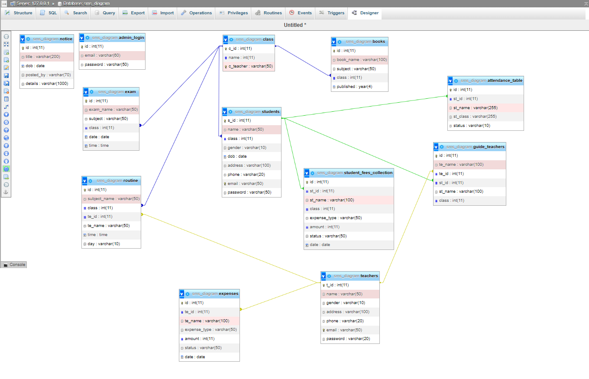
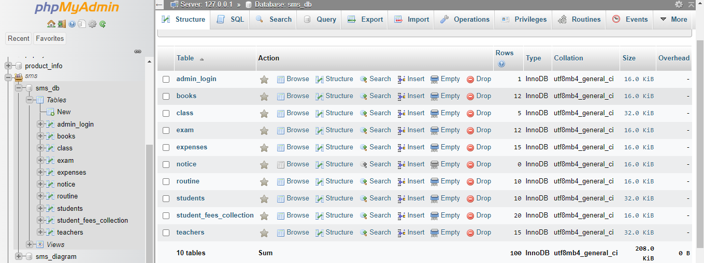

# This is an School Management System Application

## Features:  
* admin / student / teacher - Login & sign up
* add / edit / delete - teacher & student
* add / edit / delete - Notice board
* student attendence
* Accounts Section - (Teacher's Salary & Student's fees )
* Attendence Module
* Routine Module
* Exam Module
* Class Module

## Technologies:  
* Html 5
* CSS 3
* Bootstrap 4
* PHP
* mysql
* jquery

### Contributors:  
* [Mizanur Rahman](https://github.com/mizanur1326)
* [Masum Ahmed](https://github.com/masum-yasin)
* [Khayrul Alam](https://github.com/Rockrayhan)

#### database_informations:
* admin Email: abc@gmail.com
* admin Password: 123
* DB name: sms_db

## UI Diagram For Database

## Database Tables

#### contributons:
##### Mizanur Rahman
* DashBoard Customization
* Student & Teacher CRUD 
* Attendence ( in process )
* routine Module

##### Masum Hossain
* Login Module
* Implement Sessions 
* Notice Module
* Exam Module

##### Khayrul Alam
* Accounts Section
* class Module
* DB Diagram design 
* Books 